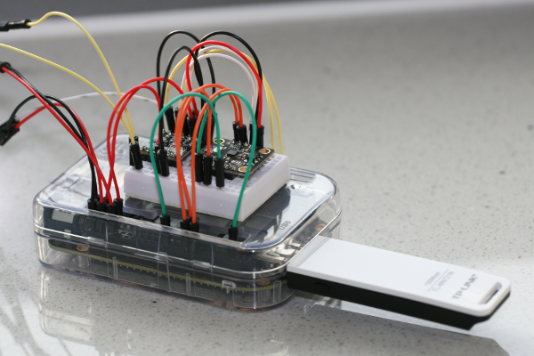
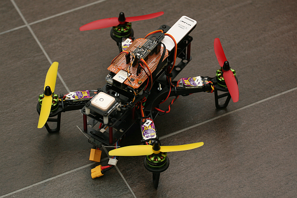

# BBBMINI
Simple ArduPilot DIY Cape for the BeagleBone Black (BBB)

## Why?
* Have fun to build your own BBB ArduPilot Cape
* Easy start to ArduPilot Linux development
* No SMD soldering required

## Hardware
* BeagleBone Black
* IMU MPU-9250, Baro MS5611 (try to get a combi breakout board)
* Spektrum Satellit SPM 9645, PPM-sum should also work
* Level shifter 3.3 Volt to 5 Volt (bidirectional)
* GPS

Click [here](doc/hardware/hardware.md) for further instruction how to assemble the board and the pin assignment.

## Software
For instructions how to get, build, test and run the software click [here](doc/software/software.md).

## Status

### Working
* RT-Kernel
* MPU-9250 (via SPI)
* MS5611 (via SPI)
* RCInput with Spektrum SPM 9645
* RCOutput
* GPS uBlox NEO-M8N (5Hz with GPS + GLONASS)
* IP connection via WLAN to groundstation (APM Planner) 
* dts file for BBBMINI
* Solder the breakout boards on a prototype cape, so it is reliable to fly.
* First flight on March 16, 2015

### ToDo
* Create documentation
