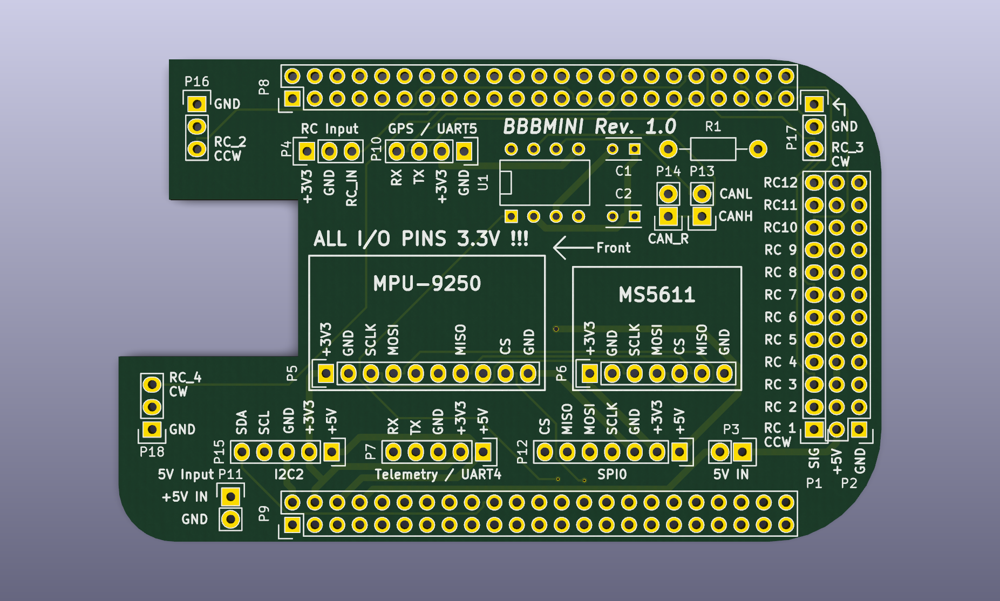
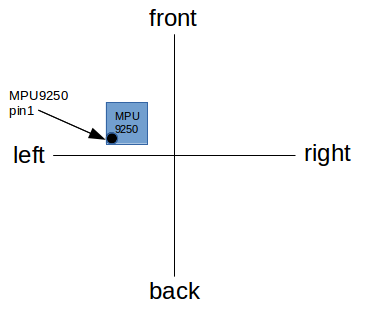

#Hardware

## BBBMINIadapter

### Schematic
[Schematic](../pic/bbbmini.pdf)

### PCB

## Power supply
For supplying power to the BBB I use a 5V 3A UBEC module.

BBB | UBEC | Remark
------------ | ------------- | -------------
P9.01 and P9.02 GND | UBEC-GND | | 
P9.05 and P9.06 VDD_5V | UBEC-5V | P9.05 and P9.06 are connected to the power plug of the BBB  |

## RCInput

### Pin assigment

BBB | RC Receiver | I/O | Remark
------------ | ------------- | ------------- | -------------
P9.01 DGND | GND | | 
P9.03 VDD_3V3 | VDD | |
P8.15 RC_IN | RC Out | IN | 3.3 Volt (Spektrum / SBUS / PPM-Sum) 

## RCOutput

### Pin assigment

BBB | ESC / Servo | I/O | Remark
------------ | ------------- | ------------- | -------------
P8.01 DGND | GND | 
P8.28 | RC_OUT_CH_1 | OUT | 3.3 Volt
P8.27 | RC_OUT_CH_2 | OUT | 3.3 Volt
P8.30 | RC_OUT_CH_3 | OUT | 3.3 Volt
P8.29 | RC_OUT_CH_4 | OUT | 3.3 Volt
P8.40 | RC_OUT_CH_5 | OUT | 3.3 Volt
P8.39 | RC_OUT_CH_6 | OUT | 3.3 Volt
P8.42 | RC_OUT_CH_7 | OUT | 3.3 Volt
P8.41 | RC_OUT_CH_8 | OUT | 3.3 Volt
P8.44 | RC_OUT_CH_9 | OUT | 3.3 Volt
P8.43 | RC_OUT_CH_10 | OUT | 3.3 Volt
P8.46 | RC_OUT_CH_11 | OUT | 3.3 Volt
P8.45 | RC_OUT_CH_12 | OUT | 3.3 Volt

## IMU MPU-9250

### Alignment

### Pin assigment

BBB | MPU-9250 | I/O | Remark
------------ | ------------- | ------------- | -------------
P9.01 DGND | GND | |
P9.03 VDD_3V3 | VDD | |
P9.28 MPU9250_CS | MPU9250_CS / nCS | OUT | 3.3 Volt
P9.29 SPI1_MISO | MISO / SD0 | IN | 3.3 Volt
P9.30 SPI1_MOSI | MOSI / SD1 / SDA / SDI | OUT | 3.3 Volt
P9.31 SPI1_SCLK | SCLK / SCL | OUT | 3.3 Volt

## Baro MS 5611

### Pin assigment

BBB | MS 5611 | I/O | Remark
------------ | ------------- | ------------- | -------------
P9.01 DGND | GND | |
P9.03 VDD_3V3 | VDD | |
P9.29 SPI1_MISO | MISO / SDO | IN | 3.3 Volt
P9.30 SPI1_MOSI | MOSI / SD1 / SDA | OUT | 3.3 Volt
P9.31 SPI1_SCLK | SCLK / SCL | OUT | 3.3 Volt
P9.42 MS5611_CS | MS5611_CS / CSB | OUT | 3.3 Volt
 | PS | | Connect to GND to switch to SPI communication

## SPI0

### Pin assigment

BBB | I/O | Remark
------------ | ------------- | ------------- | -------------
P9.01 DGND | |
P9.03 VDD_3V3 | |
P9.21 SPI0_MISO | IN | 3.3 Volt
P9.18 SPI0_MOSI | OUT | 3.3 Volt
P9.22 SPI0_SCLK | OUT | 3.3 Volt
P9.17 SPI0_CS | OUT | 3.3 Volt

## UART4 MAVLink radio module
Baudrate 57600, 8, n, 1

### Pin assigment

BBB | Radio | I/O | Remark
------------ | ------------- | ------------- | -------------
P9.01 DGND | GND | 
P9.13 TX | RADIO_RX | OUT | 3.3 Volt 
P9.11 RX | RADIO_TX | IN | 3.3 Volt

## UART5 GPS
Baudrate 38400, 8, n, 1

### Pin assigment

BBB | GPS | I/O | Remark
------------ | ------------- | ------------- | -------------
P8.01 DGND | GND | 
P8.37 TX | GPS_RX | OUT | 3.3 Volt 
P8.38 RX | GPS_TX | IN | 3.3 Volt

## CAN1 UAVCAN
You have to use a CAN transceiver (e.g. MCP 2562-E/P) for CAN datatransfer.

### Pin assigment

BBB | I/O | Remark
------------ | ------------- | -------------
P9.24 RX | IN | 3.3 Volt 
P9.26 TX | OUT | 3.3 Volt
